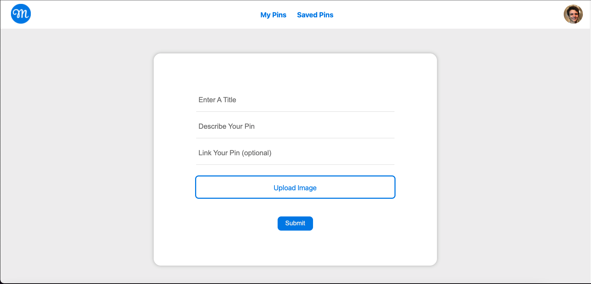
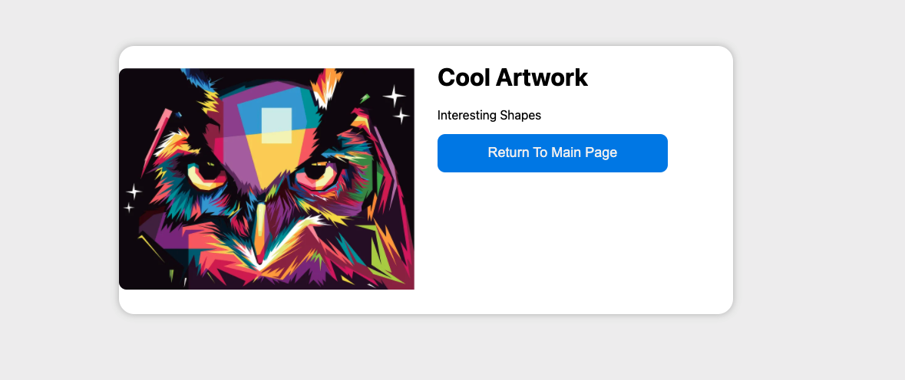

# Pinterest Clone

<!-- ABOUT THE PROJECT -->

## Sobre Projeto

<!-- [![Product Name Screen Shot][product-screenshot]](https://example.com) -->

Existem muitas boas idéias de projetos usados ​​com o objetivo principal de aprender uma tecnologia. Um bom projeto paralelo é sempre aquele que não é muito complicado, mas permite que você aprenda a sintaxe básica das tecnologias utilizadas e um pouco de como estruturar uma aplicação com essas tecnologias. Um clone do Pinterest é um bom exemplo disso. Neste projeto, você vai praticar os fundamentos da criação de uma API GraphQL (CRUD, Estrutura do Projeto, Melhores Práticas ...).

- Os usuários podem ** fazer login ** em suas contas com um simples login por e-mail / senha.
- Os usuários podem criar novos posts em seu mural.
- Uma postagem conterá uma imagem, uma descrição e um título.
- Os usuários podem ** deletar ** suas postagens.
- Os usuários podem salvar postagens de outras pessoas.
- Uma parede com as postagens de cada usuário.

### Tecnologias Usadas:

- ReactJS
- NodeJS
- GraphQL
- Apollo Client
- Qualquer banco de dados que você quiser (MongoDB recomendado)
- Cloudinary (para armazenar fotos)

#### **Nota: Todos os serviços acima são de uso gratuito**

## Starter Code:

O código fornecido já configura o cliente e o servidor. A configuração do GraphQL está concluída e um tipo já foi criado (o tipo de usuário). Usar o código inicial fornece um bom começo para o projeto, mas você precisará fazer muito por conta própria. Se você está se perguntando como estruturar o projeto, coloco algumas fotos do meu clone do Pinterest logo abaixo.

### Main Page

### Create Pin Page

### When you click on a Pin

